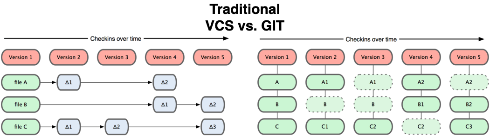

# Github Basics

This guide teaches you step-by-step how to get started with github, or other flavors of git (using the command line).

## Installation

### Mac OS:

1. Open terminal.
2. $ ``git --version``

    If you see output like:
    
    ``git version 2.20.1 (Apple Git-117)``; Git is installed.
    
    Otherwise you will be prompted to install xcode tools. Please follow steps to install these.
    
### Linux

In console

$ ``sudo apt install git``.

### Windows

Download Installer

https://git-scm.com/download/win

Please install git-bash as well. We will assume you are using git-bash to follow along with this tutorial on Windows.

    
    
    
## Motivation

Why use Git? If you are interested in doing any/all of the following

1. Use GIT for maintaining your code/design project files.
2. Collaborate with teammates over the cloud (think Google docs but for project files).
3. Better than backups: https://git-scm.com/book/en/v1/Getting-Started-Git-Basics

    
4. Publish/access open source code.

## Lifecycle

The git lifecycle includes creating versions ("commits") of your development folder as and when it changes. You will 
"add" files to be "tracked" in your folder by the `git add` command. You stage the added files for a "commit" (version) by using the git commit

## Tutorial
    

